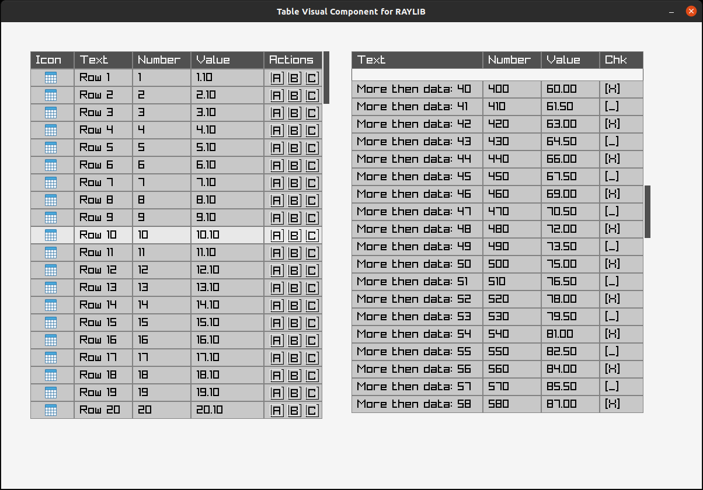
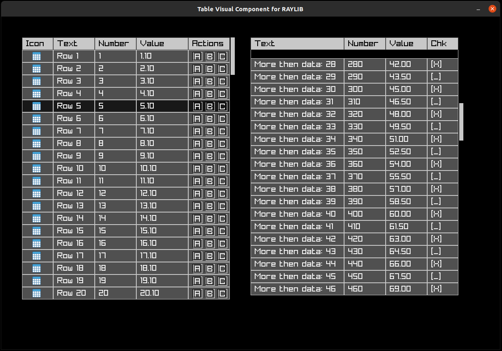

# raylib-table-ui
Table UI component for RayLib portable C library

## Intro
This is basic solution for table view UI component for RAYLIB game dev and UI library.

My intentions for creating this table UI component were:
- multiplatform (Linux as base, RayLib works on different platforms so you have it as gift!)
- to develop something easy to use and practical, no dedicated features and without complex tricks.
- multiple tables on one screen with dedicated id.
- table header with names of columns
- callback function per table, for detecting clicks on cells and return row+column location and table id.
- scrool bar on left side (you can use mouse to review data rows inside table)
- proportional (percentage) definition of colums sizes (without counting pixels needs!)
- easy dark mode support
- custom color schemas support
- software engineer wih ANSI C knowledge (on junior level) could reuse this solution (without any problems).


## Visual effect of usage this solution with RayLib

### Normal mode



### Dark mode




## How to use as C developer
```bash
$ make setup
$ make

### inside lib/ dir you can find *.a and *.o files
$ ls lib/
libraylibtableui.a  raylib_table_ui.o
```

## Solution API explanations

There are a few steps and public functions to understand how it works.
Every practical, how to use this library was presented as demo in this file [example/main.c](example/main.c).

### How to start with example/demo
```bash
$ make setup
$ make examples

### you can see new UI window with two demo tables from example code
```

### How to start from API definitions

#### Table UI data structures
You can find header file here: [include/raylib_table_ui.h](include/raylib_table_ui.h)

We have a few simple data structures:
##### CellType struct
`CellType` enum. definitions, what will be inside cell in table. Possible options are:
- `CELL_TYPE_IMAGE` - you can use images as icons inside cell
- `CELL_TYPE_TEXT` - you can put any text message inside cell
- `CELL_TYPE_NUMBER` - you can put any numeric value inside cell
- `CELL_TYPE_DOUBLE` - you can put any double/float value inside cell
- `CELL_TYPE_CHECKBOX` - you can put simple checkbox text representation with two state (enabled, disabled) inside cell

##### Cell struct
`Cell` struct defines `CellType` and union with dedicated property for selected cell.
 
##### TableRow struct
`TableRow` struct defines full row in table with multiple cells (represented by `Cell` struct.).


##### Table struct
`Table` struct. is main container for `TableRow` structs definitions and headers and callbacks.
Of course position on screen and dimensions are inside.

##### Table struct callbacks
- `void (*OnRowClickCallback)(int tableId, int row, const char *columnName);` - you can do something, when you click on table cells (in parameter, you can find row and column id and table id - there is possibliti to have multiple tables on one screen)


#### Example table UI creation in code (fragments only - please use example to review details)
```c

#include "raylib.h"
#include "raylib_table_ui.h"


void OnRowClickCallback(int tableId, int row, const char *columnName) {
    printf("Table ID: %d, Row: %d, Column: %s\n", tableId, row, columnName);
}

...
    const int darkMode = false;

    TableColors tblColors = GetTableDefaultColorsScheme(darkMode);

    // Define column names for Table 1
    const char *columnNames1[] = {"Icon", "Text", "Number", "Value"};

    // Generate rows of data for Table 1
    int numRows = 100;

    TableRow *rows1 = CreateTableRows(
      numRows,
      (int) sizeof(columnNames1)/sizeof(columnNames1[0])
    );

    // Define table 1 with sample data
    
    // Percentages column's definitions
    float colWidths1[] = {0.15f, 0.35f, 0.25f, 0.25f};
    Table table1 = {1, 50, 50, 500, 600, numRows, 30, colWidths1, rows1, 0, 15, columnNames1, false, 0, -1, OnRowClickCallback};

...

    while (!WindowShouldClose()) {
        // Check which table the mouse is over and update that table's scroll
        float delta = GetMouseWheelMove() * 30;
        if (IsMouseOverTable(&table1)) {
            UpdateTableScroll(&table1, delta);
        }

        // Handle scrollbar dragging
        HandleScrollbar(&table1);

        // Highlight row under the mouse
        HighlightRow(&table1);

        // Handle row click
        HandleRowClick(&table1);

        BeginDrawing();

        if (darkMode == true) { 
            ClearBackground(BLACK);
        } else {
            ClearBackground(RAYWHITE);
        }
        
        // Draw the tables
        DrawTable(&table1, tblColors);

        EndDrawing();
    }


...

    // WARINING! You need to have this at the end of program - it's free memory!
    DisposeTableRows(numRows, rows1);

```

## How can I use this table UI component with my private codebase?
There are multiple ways, but let's me exmplain more simple way here. 

1. You need to have two dirs (`include`, `libs`) after `make` process inside this repo.
There are include header file and compiled library (*.a and *.o) required to linking with your code.

2. Add required resources inside you compilation process i.e.:
```bash
$ gcc -o my_project.out my_project.c -Iinclude/ -llib/ -lraylib -lm
```
That's it!
You can use my RayLib's table UI from this point :-)


## TODO list
- [x] first release with demo/example
- [x] add required documentation
- [ ] put message on socials
- [ ] recive feedback after first release from Open Source
- [ ] add unit tests + code coverage
- [ ] do precise memory leaks debugging
- [ ] promotion of library in Open Source world i.e. for RayLib's deelopers (game dev, indie games companies, UI for C entusiasts, desktopo apps, etc.)


## Collaboriation is welcome

### PR process

Please feel free to add new features/fixes/updates by `Pull Request` typical process (first fork this repository, prepare patch/fix/feature, next prepare prosal in this repo.).

If you would like to be a maintaner of this code solution, please give me info.

### Open Source rules
There is totally no guaranties in case of potential any kind of risks, when you will use this code inside your project.
This is Open Source solution, works for my tools and any kind of issues are natural in Open Source space.

Enjoy with this code!
